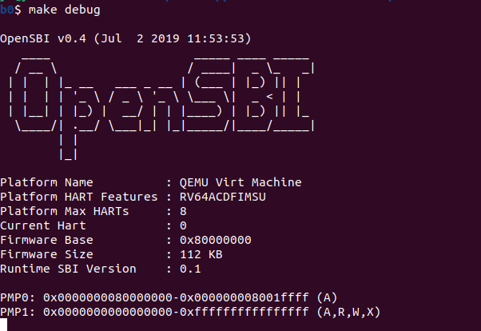

# Lab0.5

## 一.实验过程

### 练习1:启动GDB验证启动流程

*为了熟悉使用qemu和gdb进行调试工作,使用gdb调试QEMU模拟的RISC-V计算机加电开始运行到执行应用程序的第一条指令（即跳转到0x80200000）这个阶段的执行过程，说明RISC-V硬件加电后的几条指令在哪里？完成了哪些功能？要求在报告中简要写出练习过程和回答。*

#### 第一阶段：复位

1.首先进入目录labcodes/lab0，同时打开两个终端，使用命令进行调试：

```bash
make debug
make gdb
```
结果如下，可以看到GDB加载 `bin/kernel` 文件进行调试：


RISC-V计算机加电开始启动，首先进行复位，停在复位地址`0x1000`（**即上电时PC的初始值**）处。

复位代码主要**将计算机系统的各个组件（包括处理器、内存、设备等）置于初始状态，并且会启动Bootloader。**
这里QEMU的复位代码指定加载Bootloader的位置为0x80000000，Bootloader将加载操作系统内核并启动操作系统的执行。
```bash
0x0000000000001000 in ?? ()
```
2.进入gdb中通过命令`x/10i $pc`显示即将执行的10条汇编指令。

```bash
0x0000000000001000 in ?? ()
(gdb) x/10i $pc
=> 0x1000:	auipc	t0,0x0 #auipc指令将一个立即数（20位）左移12位并将结果加到当前 PC 寄存器的值上，从而生成一个全局地址。即t0 = pc + 0 << 12 = 0x1000
   0x1004:	addi	a1,t0,32 #a1=t0+32= 0x1020
   0x1008:	csrr	a0,mhartid #读取控制和状态寄存器 mhartid 的值，然后存入寄存器 a0。mhartid 保存的是当前硬件线程的 ID。
   0x100c:	ld	t0,24(t0) #t0=[t0+24]= 0x80000000
   0x1010:	jr	t0 #PC=t0,跳转到寄存器 t0 中的地址
   #后续指令不会执行
   0x1014:	unimp #未实现的指令
   0x1016:	unimp
   0x1018:	unimp
   0x101a:	0x8000 
   0x101c:	unimp
```

下面使用`si`命令逐行调试，借助`info r t0`指令查看寄存器t0结果：
```bash
(gdb) si
0x0000000000001004 in ?? ()
(gdb) info r t0
t0             0x1000	4096
(gdb) si       
0x0000000000001008 in ?? ()
(gdb) info r t0
t0             0x1000	4096
(gdb) si       
0x000000000000100c in ?? () #t0 = [t0 + 24]
(gdb) info r t0
t0             0x1000	4096
(gdb) si         
0x0000000000001010 in ?? ()
(gdb) info r t0  #t0值更新为0x80000000
t0             0x80000000	2147483648 
(gdb) si       
0x0000000080000000 in ?? ()  #跳转到地址0x80000000
```

#### 第二阶段：Bootloader即OpeSBI启动

进入到`0x80000000`后，使用命令`x/10i $pc`显示即将执行的10条汇编指令。

```bash
(gdb) x/10i $pc
=> 0x80000000:	csrr	a6,mhartid # a6 = mhartid (获取当前硬件线程的ID)
   0x80000004:	bgtz	a6,0x80000108 #bgtz：大于则分支。a6>0,则跳转到0x80000108
   0x80000008:	auipc	t0,0x0 #t0 = pc + (0x0 << 12) = 0x80000008
   0x8000000c:	addi	t0,t0,1032 # t0 = t0 + 1032 = 0x80000408
   0x80000010:	auipc	t1,0x0 # t1 = pc + (0x0 << 12) = 0x80000010
   0x80000014:	addi	t1,t1,-16 # t1 = t1 - 16 = 0x80000000
   0x80000018:	sd	t1,0(t0) # 将t1的值（0x80000000）存储在地址0x80000408处
   0x8000001c:	auipc	t0,0x0 # t0 = pc + (0x0 << 12) = 0x8000001c
   0x80000020:	addi	t0,t0,1020 # t0 = t0 + 1020 = 0x80000400
   0x80000024:	ld	t0,0(t0) # t0 = [t0 + 0] = [0x80000400] (从地址0x80000400加载一个双字到t0)
```
为了正确地和上一阶段的 OpenSBI 对接，需要保证内核的第一条指令位于物理地址 0x80200000 处，因为这里的代码是**地址相关的**，这个地址是由处理器，即Qemu指定的。为此，我们需要将内核镜像预先加载到 Qemu 物理内存以地址 0x80200000 开头的区域上。

#### 第三阶段：加载操作系统内核

通过命令`break *0x80200000`在预先已经知道会被加载的内核镜像位置打上断点，并运行到对应位置。
```bash
(gdb) break *0x80200000
Breakpoint 1 at 0x80200000: file kern/init/entry.S, line 7.
```
地址0x80200000由kernel.ld中定义的BASE_ADDRESS（加载地址）所决定，标签kern_entry是在kernel.ld中定义的ENTRY（入口点）

kernel_entry内容如下：
```bash
la sp, bootstacktop #将bootstacktop的地址赋给sp，初始化了栈指针，指向启动栈的顶部。
tail kern_init #调用kern_init函数。tail指令表示当前函数（kern_entry）不需要返回，从而允许进行优化，直接跳转到kern_init。
```
使用`x/5i $pc`查看此处的5条指令:
```bash
(gdb) continue
Continuing.

Breakpoint 1, kern_entry () at kern/init/entry.S:7
7	    la sp, bootstacktop
(gdb) x/5i $pc
=> 0x80200000 <kern_entry>:		auipc	sp,0x3 # sp = pc + (0x3 << 12) = 0x80200000 + (0x3 << 12) = 0x80203000
   0x80200004 <kern_entry+4>:	mv	sp,sp #这条指令没有实质性的操作，可能用于延续上下文或作为占位符
   0x80200008 <kern_entry+8>:	j	0x8020000c <kern_init> # 无条件跳转到地址0x8020000c
```
以上三段代码等价于kern_entry中的：
	
	```assembly
	la sp, bootstacktop
	tail kern_init
	```
继续分析后续指令：
```bash
   0x8020000c <kern_init>:		auipc	a0,0x3 # a0 = pc + (0x3 << 12) = 0x8020000c + (0x3 << 12) = 0x8020300c 
   0x80200010 <kern_init+4>:	addi	a0,a0,-4 # a0 = a0 - 4 = 0x8020300c - 4 = 0x80203008
```
可以看到在`kern_entry`之后，紧接着就是`kern_init`，主要用于内核的初始化等。

输入`continue`执行，可以看到debug的终端输出如下：

这说明OpenSBI此时已经启动。

接着输入指令`break kern_init`，输出如下：

```bash
Breakpoint 2 at 0x8020000c: file kern/init/init.c, line 8.
```
指向`<kern_init>`的地址`0x8020000c`

kern_init函数定义如下：
```bash
int kern_init(void) {
    extern char edata[], end[]; #这里声明的两个符号，实际上由链接器ld在链接过程中定义, 所以加了extern关键字

    memset(edata, 0, end - edata); #使用string.h中自定义memset 函数将 edata 到 end 之间的所有内存设置为零。用于清空未初始化的数据（BSS）段。

    const char *message = "(THU.CST) os is loading ...\n";

    cprintf("%s\n\n", message);  

   while (1) #创建死循环，表示内核在完成初始化后将进入一个空闲状态。内核不再执行任何其他操作，等待后续事件或中断。
        ;
}
```
输入`continue`，debug窗口出现以下输出：

```
(THU.CST) os is loading ...
```
## 二、问题回答
1. RISCV加电后的几条指令在`0x1000-0x1010`地址。
2. 完成的功能包括：
+ 初始化寄存器 t0 为当前 PC 的值（0x1000），用于PC相对寻址
+ 计算 a1 的值为 0x1020
+ 将机器硬件线程 ID 加载到 a0 中
+ 加载数据到 t0（0x80000000）
+ 跳转到地址 0x80000000 执行后续指令。


总的来说，在 Qemu 开始执行任何指令之前，**首先进行复位，然后两个文件将被加载到 Qemu 的物理内存中：** 即作为 bootloader 的 OpenSBI.bin 被加载到物理内存以物理地址 0x80000000 开头的区域上，然后内核镜像 os.bin 被加载到以物理地址 0x80200000 开头的区域上。

## 三.实验中的知识点

1、实验过程需要打开两个终端：因为运行 `make debug` 时，它将会调用Makefile中定义的一系列命令来构建程序，运行 `make gdb` 将启动GDB，并使用GDB来调试之前用 `make debug` 构建的那个二进制文件。


2、内核栈：

Bootloader是操作系统内核的启动程序，负责将内核加载到内存并启动它。Bootloader初始化内核栈，为其提供临时数据存储空间。启动后的内核使用内核栈处理任务、系统调用和中断等。因此，内核栈对内核至关重要。


3、地址相关代码(PDC)与地址无关代码(PIC):

二者主要区别在于代码中是否包含硬编码的内存地址。

**PIC**:
  - 不依赖于特定的内存地址。
  - 使用相对寻址或寄存器间接寻址。
  - 适用于共享库等场景。
  
**PDC**:
  - 依赖于特定的内存地址。
  - 使用绝对寻址。
  - 适用于独立的可执行文件。

4、程序执行流程：加电，从`0x1000`开始执行->跳转到`0x80000000`，启动`OpenSBI`->跳转到`0x80200000`，运行`kern_entry`(`kern/init/entry.S`)->进入`kern_init()`函数(`kern_init/init.c`)->调用`cprintf()`输出一行信息->进入循环

